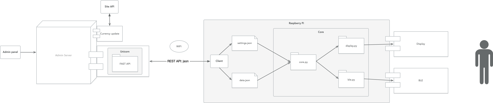

# BLE
Course project: Электронные ценники

## develop links
1. [Master](https://github.com/Dmitriy1594/iBeacon)
1. [pc-develop: create server and admin](https://github.com/Dmitriy1594/iBeacon/tree/pc-develop)
1. [develop raspberry pi](https://github.com/Dmitriy1594/iBeacon/tree/develop_raspberry_pi)

## Description

## Tasks

### PC
1. необходимо сделать admin panel (с помощьью нее можно обновлять настройки, данные для отображения на дисплее)
1. Необходимо написать сервер на основе FastAPI и uvicorn
1. Необходимо обрабатиывать информацию о расстоянии до пользователя

### Raspberry Pi

#### Client 
1. необходима валидация данных data.json с учетом текущих settings.json
1. как отправлять запрос на сервер для обновления data.json и settings.json
1. как сделать remote перезапуск дисплея, если постоянно ждем ввода кнопки?
1. как передавать расстояние до пользователя на сервер?
#### BLE
1. расчет расстояния до пользователя для включения дисплея
1. включать ожидание нажатия на кнопки при достижении определенного расстояния

